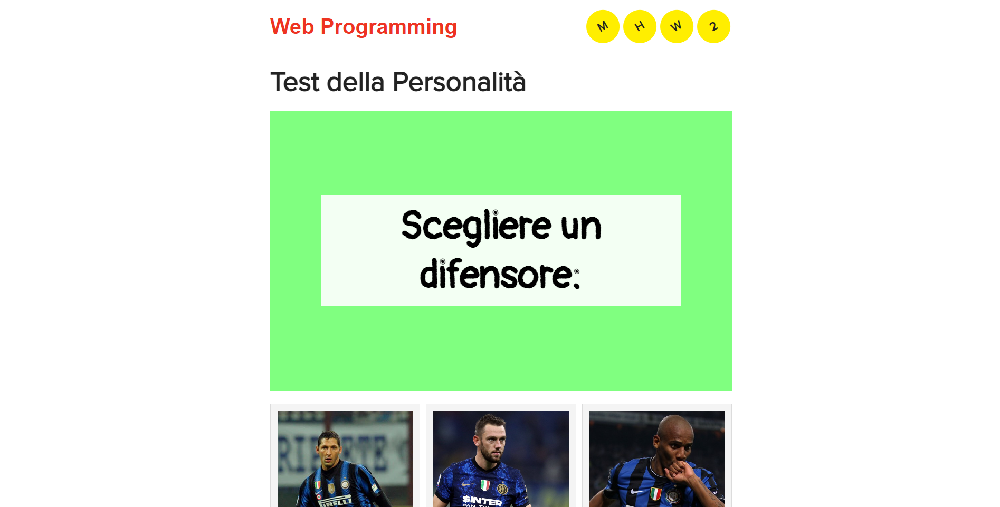
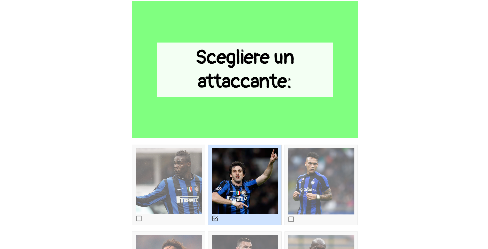
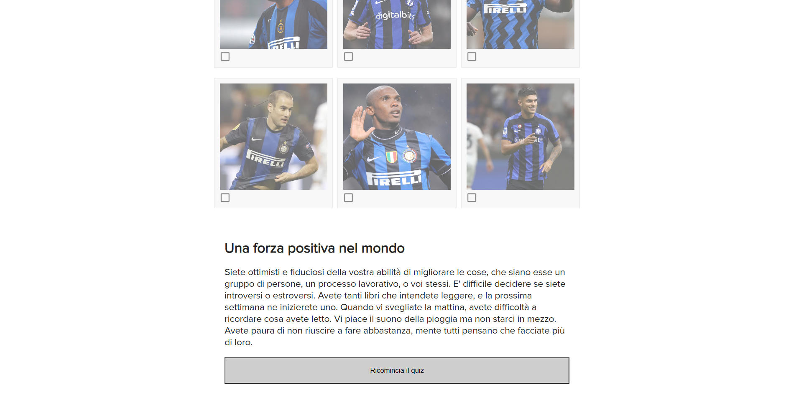

## Personality Test Project
This project is a web-based personality test developed as part of a web development course at university. The application is built using HTML, CSS, and JavaScript, and it allows users to answer a series of questions to determine their personality traits based on the chosen assessment model.   
  

## Features 
User-Friendly Interface: The application provides an intuitive and engaging user interface for answering the personality test questions. 
Dynamic Questionnaire: The test presents questions dynamically, allowing users to progress through the assessment at their own pace. 
Personality Assessment: Upon completing the test, users receive a personalized result based on the assessment model used. 
Interactive Feedback: The application provides interactive feedback to users during the test, enhancing the overall user experience.  

## Screenshot
  
  
  

## Technologies Used
HTML: Used for creating the structure and content of the web pages.  
CSS: Used for styling the user interface and improving the visual presentation of the personality test.  
JavaScript: Used for implementing interactive features, dynamic content, and client-side functionality.  
